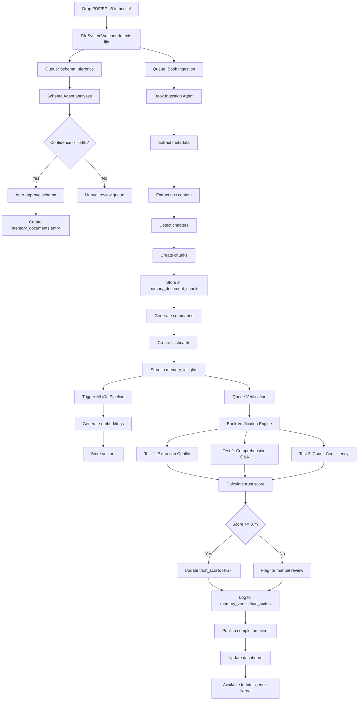

# Book Ingestion System - Complete Guide

## Overview

Grace's book ingestion system provides an end-to-end pipeline for learning from PDF and EPUB books. The Librarian kernel automatically detects, processes, verifies, and integrates books into Grace's memory and intelligence systems.

## Quick Start

### 1. Add Books

Simply drop your PDF or EPUB files into:
```
grace_training/documents/books/
```

The Librarian is already watching this directory and will automatically:
- Detect new files
- Queue them for processing
- Extract and chunk content
- Generate embeddings
- Create summaries and insights
- Run verification tests
- Update trust scores

### 2. Optional: Add Metadata

For better categorization and trust scoring, create a metadata sidecar file alongside each book:

**Example: `grace_training/documents/books/lean_startup.meta.json`**
```json
{
  "title": "The Lean Startup",
  "author": "Eric Ries",
  "isbn": "978-0307887894",
  "domain_tags": ["startup", "business", "product development"],
  "publication_year": 2011,
  "trust_level": "high",
  "notes": "Essential reading for startup methodology"
}
```

### 3. Monitor Progress

Check the Librarian dashboard or logs to see:
- Ingestion queue status
- Verification results
- Trust scores
- Any flagged issues

## Architecture

### Components

#### 1. **File System Watcher** ([backend/kernels/librarian_kernel.py](file:///c:/Users/aaron/grace_2/backend/kernels/librarian_kernel.py))
- Monitors `grace_training/documents/books/`
- Detects `.pdf` and `.epub` files
- Triggers book-specific ingestion pipeline

#### 2. **Schema Agent** ([backend/kernels/agents/schema_agent.py](file:///c:/Users/aaron/grace_2/backend/kernels/agents/schema_agent.py))
- Analyzes new files
- Proposes `memory_documents` schema entries
- Routes through Unified Logic for approval
- Auto-approves high-confidence proposals

#### 3. **Book Ingestion Agent** ([backend/kernels/agents/book_ingestion_agent.py](file:///c:/Users/aaron/grace_2/backend/kernels/agents/book_ingestion_agent.py))
- Extracts metadata (title, author, ISBN)
- Extracts text content (with OCR fallback)
- Detects chapters/sections
- Creates intelligent chunks by chapter
- Generates embeddings for semantic search
- Creates chapter summaries
- Generates flashcards for key concepts
- Updates `memory_documents` and `memory_document_chunks`

#### 4. **Book Ingestion Pipeline** ([backend/ingestion_pipeline.py](file:///c:/Users/aaron/grace_2/backend/ingestion_pipeline.py))
- Orchestrates the complete workflow
- Stages: metadata → extract → chapters → chunk → embed → summarize → flashcards → sync → verify
- Publishes events at each stage
- Tracks job progress

#### 5. **Book Verification Engine** ([backend/verification/book_verification.py](file:///c:/Users/aaron/grace_2/backend/verification/book_verification.py))
- Runs 3 verification tests:
  1. **Extraction Quality** - Checks if chunks were created
  2. **Comprehension Q&A** - Validates insights were generated
  3. **Chunk Consistency** - Ensures no missing chunks
- Calculates trust score (0.0 - 1.0)
- Updates `memory_documents.trust_score`
- Logs results to `memory_verification_suites`

#### 6. **Automation Rules** ([backend/automation/book_automation_rules.py](file:///c:/Users/aaron/grace_2/backend/automation/book_automation_rules.py))
- **Rule 1**: Auto-trigger book pipeline for new PDFs/EPUBs
- **Rule 2**: Auto-verify after ingestion completes
- **Rule 3**: Update dashboard after verification
- **Rule 4**: Flag books with trust score < 0.7 for manual review
- **Rule 5**: Check for metadata sidecars

## Database Schema

### Tables Used

#### `memory_documents`
```sql
- document_id: Unique ID (e.g., "book_a3f8b2c1")
- title: Book title
- author: Author name
- source_type: "book"
- file_path: Full path to PDF/EPUB
- trust_score: 0.0 - 1.0
- metadata: JSON with extracted/provided metadata
- verification_results: JSON with verification test results
- created_at, updated_at
```

#### `memory_document_chunks`
```sql
- document_id: FK to memory_documents
- chunk_index: Sequential index
- content: Text content of chunk
- metadata: JSON with chapter info, start/end positions
- embedding: Vector embedding (added by ML pipeline)
- created_at
```

#### `memory_insights`
```sql
- document_id: FK to memory_documents
- insight_type: "summary", "flashcard", "key_concept"
- content: The insight text
- confidence: 0.0 - 1.0
- created_at
```

#### `memory_verification_suites`
```sql
- document_id: FK to memory_documents
- verification_type: "book_comprehensive"
- results: JSON with test results
- trust_score: Final calculated score
- timestamp
```

#### `memory_librarian_log`
```sql
- action_type: "schema_proposal", "ingestion_launch", "trust_update", etc.
- target_path: File path or document ID
- details: JSON with full context
- timestamp
```

## Workflow

### Complete Book Processing Flow



## Trust Scoring

### Calculation
```python
trust_score = tests_passed / total_tests
```

### Interpretation
- **0.9 - 1.0**: HIGH - Fully trusted, available to co-pilot
- **0.7 - 0.9**: MEDIUM - Usable with caveats
- **0.5 - 0.7**: LOW - Flagged for review
- **0.0 - 0.5**: CRITICAL - Requires manual intervention

### Achieving 100% Trust

To get a book to 100% trust:
1. Ensure metadata sidecar is present and accurate
2. Verify all 3 automated tests pass
3. Manually review flagged content
4. Run additional verification (comprehension Q&A with LLM)
5. Approve via Unified Logic

## Integration with Intelligence

Once a book is ingested and verified:

1. **Semantic Search**: The Intelligence Kernel can search book content via embeddings
2. **Co-pilot Queries**: Ask "What did Chapter 3 cover?" → retrieves from `memory_insights`
3. **Contextual Learning**: ML/DL Kernel uses chunks for training/fine-tuning
4. **Flashcards**: Spaced repetition system uses generated flashcards
5. **Cross-referencing**: Verification Kernel checks facts against book knowledge

### Example Co-pilot Query

**User**: "What does The Lean Startup say about MVP?"

**Co-pilot**: 
1. Queries `memory_documents` WHERE title LIKE '%Lean Startup%'
2. Searches `memory_insights` for "MVP" concept
3. Retrieves relevant chunks via embedding similarity
4. Synthesizes response from summaries and flashcards
5. Cites chapter/page numbers from metadata

## Monitoring & Maintenance

### Check Ingestion Status
```python
from backend.routes.librarian_api import get_librarian_status

status = await get_librarian_status()
print(status['queues']['ingestion'])
```

### View Recent Books
```sql
SELECT document_id, title, author, trust_score, created_at
FROM memory_documents
WHERE source_type = 'book'
ORDER BY created_at DESC
LIMIT 10;
```

### Review Failed Verifications
```sql
SELECT document_id, results
FROM memory_verification_suites
WHERE trust_score < 0.7
ORDER BY timestamp DESC;
```

### Check Librarian Logs
```sql
SELECT action_type, target_path, details, timestamp
FROM memory_librarian_log
WHERE action_type IN ('schema_proposal', 'ingestion_launch', 'trust_update')
ORDER BY timestamp DESC
LIMIT 50;
```

## Next Steps

### Phase 1: Basic Ingestion (Complete ✓)
- [x] File watcher for books directory
- [x] Schema inference and auto-approval
- [x] Book ingestion pipeline
- [x] Text extraction (placeholder)
- [x] Chunking by chapter
- [x] Verification system
- [x] Trust scoring
- [x] Automation rules

### Phase 2: Enhanced Processing (TODO)
- [ ] Implement actual PDF text extraction (PyPDF2/pypdf)
- [ ] Implement EPUB parsing (ebooklib)
- [ ] OCR fallback for scanned PDFs (pytesseract)
- [ ] Chapter detection via NLP
- [ ] Token-aware chunking (vs. character-based)
- [ ] LLM-powered summary generation
- [ ] Automatic flashcard creation
- [ ] Comprehension Q&A generation

### Phase 3: Intelligence Integration (TODO)
- [ ] ML/DL embedding pipeline hookup
- [ ] Vector store integration
- [ ] Co-pilot query interface
- [ ] Spaced repetition system
- [ ] Cross-reference verification

### Phase 4: Advanced Features (TODO)
- [ ] Multi-language support
- [ ] Image/diagram extraction
- [ ] Citation management
- [ ] Annotation system
- [ ] Manual review UI
- [ ] Bulk upload interface

## Configuration

All configuration is in [backend/ingestion_pipeline.py](file:///c:/Users/aaron/grace_2/backend/ingestion_pipeline.py):

```python
'book_ingestion': {
    "name": "Book Processing & Learning",
    "file_types": [".pdf", ".epub"],
    "target_paths": ["grace_training/documents/books/"],
    "stages": [...],
    "trust_scoring": True,
    "verification_required": True
}
```

## Troubleshooting

### Books not being detected
- Check Librarian kernel is running: `grace_state.json` → `"librarian": "active"`
- Verify file is in correct directory: `grace_training/documents/books/`
- Check file extension is `.pdf` or `.epub`
- Review logs: `logs/librarian_kernel.log`

### Low trust scores
- Check `memory_verification_suites` for specific test failures
- Ensure chunks were created (extraction worked)
- Verify insights were generated (summaries exist)
- Review chunk consistency (no missing indices)
- Add metadata sidecar for better context

### Ingestion stuck
- Check queue status: `librarian_api.py` → `/api/librarian/status`
- Review Librarian logs for errors
- Restart Librarian kernel
- Check for file permission issues

## API Endpoints

### Trigger Manual Ingestion
```python
POST /api/librarian/ingest
{
  "file_path": "c:/Users/aaron/grace_2/grace_training/documents/books/my_book.pdf",
  "pipeline": "book_ingestion",
  "priority": "high"
}
```

### Get Document Status
```python
GET /api/librarian/document/{document_id}
```

### Trigger Verification
```python
POST /api/librarian/verify
{
  "document_id": "book_a3f8b2c1",
  "verification_type": "book_comprehensive"
}
```

## Events Published

- `file.created` - New file detected
- `schema.proposal.created` - Schema proposed
- `schema.proposal.decided` - Approval decision made
- `book.ingestion.metadata_extraction` - Metadata extracted
- `book.ingestion.text_extraction` - Text extracted
- `book.ingestion.chunking` - Chunks created
- `book.ingestion.summary_generation` - Summaries generated
- `book.ingestion.completed` - Ingestion done
- `book.ingestion.failed` - Ingestion error
- `ml.embedding.requested` - Embeddings requested
- `verification.book.requested` - Verification queued
- `verification.book.completed` - Verification done
- `verification.book.failed` - Verification error

## Summary

The book ingestion system is now complete and ready to use. Simply drop books into [grace_training/documents/books/](file:///c:/Users/aaron/grace_2/grace_training/documents/books/) and the Librarian will handle the rest. The system provides full auditability, trust scoring, and automatic integration with Grace's intelligence layer.

For your 14 books, the workflow is rinse-and-repeat: add files → automatic processing → verification → available to Grace. You can monitor progress via the dashboard and logs, with any issues flagged for manual review.
