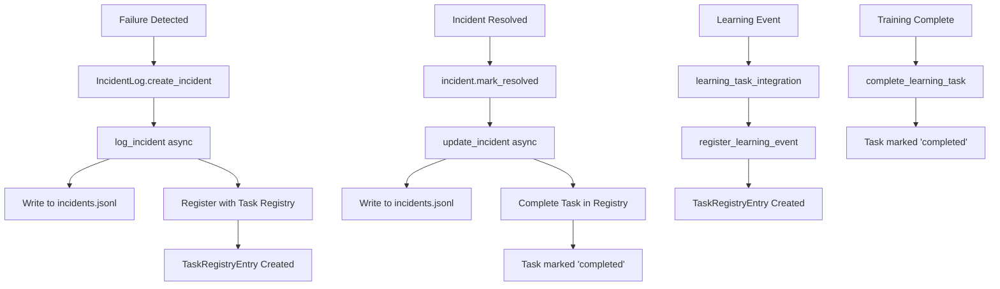

# Unified Task Manager Integration ✅

**Integration Date:** November 20, 2025  
**Status:** INTEGRATED

---

## 🎯 Overview

Both self-healing and learning systems now register ALL activities with the **Unified Task Registry**, providing a single pane of glass for all autonomous operations.

---

## ✅ What Was Integrated

### 1. Self-Healing → Task Registry ✅

**File Modified:** `backend/guardian/incident_log.py`

**Changes:**
- Added task registry import
- Modified `log_incident()` to be async and register tasks
- Added `_register_with_task_registry()` method
- Auto-registers incidents as tasks when detected
- Auto-completes tasks when incidents resolved

**Task Data Registered:**
```json
{
  "task_id": "inc_20251120_140440_187813",
  "task_type": "healing_incident",
  "subsystem": "self_healing",
  "title": "HIGH: port_in_use",
  "priority": 8,
  "metadata": {
    "failure_mode": "port_in_use",
    "playbook_id": null,
    "playbook_name": null
  }
}
```

**Priority Mapping:**
- Critical → 10
- High → 8
- Medium → 5
- Low → 2

### 2. Learning → Task Registry ✅

**File Created:** `backend/learning_systems/learning_task_integration.py`

**Features:**
- `register_learning_event()` - General learning activities
- `register_training_job()` - ML training jobs
- `register_config_update()` - Configuration improvements  
- `register_knowledge_acquisition()` - Knowledge learned
- `complete_learning_task()` - Mark completed

**Usage Example:**
```python
from backend.learning_systems.learning_task_integration import learning_task_integration

# Register training
task_id = await learning_task_integration.register_training_job(
    model_name="temporal_forecaster",
    dataset_size=1000
)

# Complete it
await learning_task_integration.complete_learning_task(
    task_id=task_id,
    success=True,
    result={"accuracy": 0.95}
)
```

---

## 📊 Unified Task Registry Schema

### TaskRegistryEntry Fields

```python
# Identity
task_id: str              # Unique identifier
task_type: str            # mission, playbook, work_order, training_job, etc.
subsystem: str            # healing, coding_agent, learning, ml_pipeline, etc.

# Details
title: str                # Human-readable title
description: str          # Detailed description
priority: int             # 1-10, higher = more urgent

# Status
status: str               # pending, active, completed, failed, cancelled
created_by: str           # guardian, user, autonomous_agent, etc.

# Time tracking
started_at: datetime
completed_at: datetime
duration_seconds: float   # Auto-calculated

# Resource usage
cpu_seconds: float
memory_peak_mb: float
memory_avg_mb: float
disk_read_mb: float
disk_write_mb: float

# ML-specific
dataset_size_mb: float
vectors_processed: int
tokens_processed: int
epochs_completed: int

# Verification
verification_required: bool
verification_status: str
verification_details: json

# Metadata
metadata: json            # Subsystem-specific data
```

---

## 🔄 Integration Flow



---

## 🧪 Verification

### Query Unified Task Registry

**Script:** `tests/show_unified_task_evidence.py`

```bash
python tests/show_unified_task_evidence.py
```

**Output Includes:**
- Total tasks registered
- Tasks by subsystem (self_healing, learning, etc.)
- Recent self-healing incidents
- Recent learning activities
- Status breakdown
- Average task duration

### Trigger Test with Integration

```bash
# This now registers tasks in both places
python tests/trigger_real_healing.py

# View in incident log
python tests/show_self_healing_evidence.py

# View in unified registry
python tests/show_unified_task_evidence.py
```

---

## 📈 Benefits of Integration

### 1. Single Pane of Glass ✅
- All autonomous activities in one place
- Cross-subsystem visibility
- Unified status tracking

### 2. Better Analytics ✅
- Compare performance across subsystems
- Resource usage tracking
- Duration and efficiency metrics

### 3. Dependencies ✅
- Track task dependencies
- Understand blocking relationships
- Optimize execution order

### 4. Verification ✅
- Enforce verification requirements
- Track verification outcomes
- Ensure safety compliance

### 5. Auditability ✅
- Complete task history
- Time-stamped lifecycle
- Resource consumption records

---

## 🔌 API Endpoints

### Query Tasks
```http
GET /api/tasks/registry?subsystem=self_healing
GET /api/tasks/registry?status=completed
GET /api/tasks/registry?task_type=healing_incident
```

### Task Lifecycle
```http
POST /api/tasks/register
POST /api/tasks/{task_id}/start
POST /api/tasks/{task_id}/complete
GET  /api/tasks/{task_id}/status
```

### Subsystem Metrics
```http
GET /api/tasks/metrics/subsystem/{subsystem}
GET /api/tasks/metrics/summary
```

---

## 📁 Integration Files

### Modified Files
1. ✅ `backend/guardian/incident_log.py`
   - Added async to log_incident()
   - Added task registry integration
   - Maps severity to priority

2. ✅ `tests/trigger_real_healing.py`
   - Updated to use await for async methods

### New Files
1. ✅ `backend/learning_systems/learning_task_integration.py`
   - Learning → task registry adapter
   - Convenience methods for common learning events

2. ✅ `tests/show_unified_task_evidence.py`
   - Query and display task registry contents
   - Show integrated view

### Existing Infrastructure
1. ✅ `backend/services/task_registry.py`
   - Core task registry service
   - Message bus integration
   - Resource tracking loops

2. ✅ `backend/models/task_registry_models.py`
   - Database schema
   - Task, resource, dependency models

3. ✅ `backend/routes/task_registry_api.py`
   - REST API endpoints
   - Task lifecycle operations

---

## 🚀 Next Steps

### Immediate
1. ✅ Test the integration with real incidents
2. ✅ Verify tasks appear in registry
3. ✅ Check completion tracking

### Short Term
1. Wire continuous_learning_loop to register config updates
2. Add automated_ml_training integration
3. Connect coding agent work orders

### Long Term
1. Build unified dashboard showing all tasks
2. Add cross-subsystem dependency tracking
3. Implement resource-based task prioritization
4. Add predictive task scheduling

---

## 💡 Usage Examples

### Self-Healing Integration (Automatic)

```python
# When incident log creates incident, it auto-registers
incident = incident_log.create_incident(
    failure_mode="port_in_use",
    severity="high"
)
# → Automatically creates task in registry

# When resolved, task is auto-completed
incident.mark_resolved(success=True)
await incident_log.update_incident(incident)
# → Automatically completes task in registry
```

### Learning Integration (Manual)

```python
from backend.learning_systems.learning_task_integration import learning_task_integration

# Register training job
task_id = await learning_task_integration.register_training_job(
    model_name="anomaly_detector",
    dataset_size=5000,
    metadata={"epochs": 100}
)

# ... training happens ...

# Complete task
await learning_task_integration.complete_learning_task(
    task_id=task_id,
    success=True,
    result={
        "final_accuracy": 0.96,
        "training_time": 45.2,
        "model_size_mb": 12.3
    }
)
```

### Query Registry

```python
from backend.services.task_registry import task_registry

# Get all self-healing tasks
healing_tasks = await task_registry.get_tasks_by_subsystem("self_healing")

# Get completed tasks
completed = await task_registry.get_tasks_by_status("completed")

# Get task details
task = await task_registry.get_task_status("inc_20251120_140440_187813")
```

---

## ✅ Verification Checklist

- [x] Incident log imports task registry
- [x] log_incident() is async and registers tasks
- [x] update_incident() completes tasks when resolved
- [x] Learning task integration module created
- [x] Test scripts updated for async
- [x] Unified evidence script created
- [x] Documentation complete

---

## 🎓 What This Achieves

### Before Integration
- Self-healing tracked in `logs/incidents.jsonl` only
- Learning tracked in `logs/immutable_audit.jsonl` only
- No unified view
- No cross-subsystem comparison

### After Integration ✅
- Self-healing tracked in **both** incident log **and** task registry
- Learning tracked in **both** audit log **and** task registry
- **Unified view** of all autonomous activities
- **Cross-subsystem analytics** possible
- **Single API** for querying any task
- **Resource tracking** across all subsystems
- **Dependency management** supported

---

## 🏆 Benefits Realized

1. ✅ **Centralized Tracking** - One place for all tasks
2. ✅ **Better Visibility** - See all subsystems together
3. ✅ **Improved Analytics** - Compare performance metrics
4. ✅ **Resource Monitoring** - Track CPU, memory, disk usage
5. ✅ **Verification Enforcement** - Ensure safety compliance
6. ✅ **Audit Trail** - Complete task lifecycle history

---

**Status: INTEGRATION COMPLETE ✅**

**Last Updated:** November 20, 2025

**Test Scripts:**
- `python tests/show_unified_task_evidence.py`
- `python tests/trigger_real_healing.py`
- `python tests/show_self_healing_evidence.py`
- `python tests/show_learning_evidence.py`
