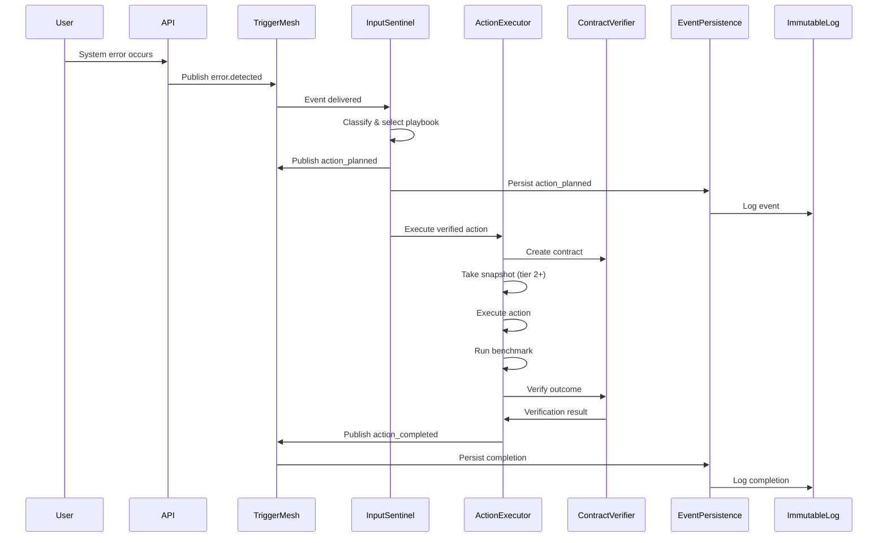
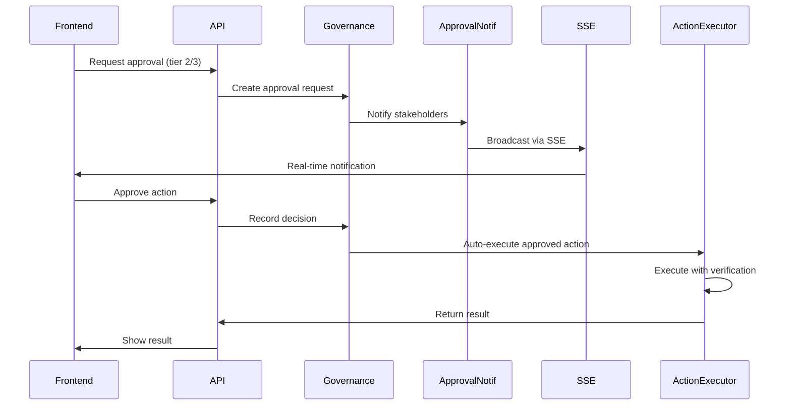

# Grace System Integration Map

**Complete wiring diagram from foundation to agentic layer.**

This document maps all connections, ensuring nothing lurks in the shadows.

---

## 🏗️ Architecture Layers

```
┌─────────────────────────────────────────────────────────────┐
│                      API LAYER                               │
│  FastAPI routes, SSE endpoints, WebSocket handlers          │
└─────────────────────────────────────────────────────────────┘
                            ↓
┌─────────────────────────────────────────────────────────────┐
│                  OBSERVABILITY LAYER                         │
│  Structured logs, Prometheus metrics, Correlation IDs       │
└─────────────────────────────────────────────────────────────┘
                            ↓
┌─────────────────────────────────────────────────────────────┐
│                 ORCHESTRATION LAYER                          │
│  Async jobs, Data aggregation, Approval notifications       │
└─────────────────────────────────────────────────────────────┘
                            ↓
┌─────────────────────────────────────────────────────────────┐
│                   EXECUTION LAYER                            │
│  Action executor, Input sentinel, Self-heal adapters        │
└─────────────────────────────────────────────────────────────┘
                            ↓
┌─────────────────────────────────────────────────────────────┐
│                  PERSISTENCE LAYER                           │
│  Event persistence, Contracts, Benchmarks, Missions         │
└─────────────────────────────────────────────────────────────┘
                            ↓
┌─────────────────────────────────────────────────────────────┐
│                   FOUNDATION LAYER                           │
│  Database (SQLite/WAL), Trigger Mesh, Immutable Log         │
└─────────────────────────────────────────────────────────────┘
```

---

## 🔌 Component Wiring Matrix

### Foundation Layer

| Component | Wired To | Status | File |
|-----------|----------|--------|------|
| **Database (SQLite)** | All models via SQLAlchemy | ✅ | `base_models.py` |
| **Trigger Mesh** | All subsystems via pub/sub | ✅ | `trigger_mesh.py` |
| **Immutable Log** | All subsystems for audit | ✅ | `immutable_log.py` |
| **WAL Mode** | Enabled at startup | ✅ | `main.py:104` |

### Persistence Layer

| Component | Wired To | Status | File |
|-----------|----------|--------|------|
| **ActionEvent** | Trigger Mesh events | ✅ | `event_persistence.py` |
| **ActionContract** | Action executor | ✅ | `action_contract.py` |
| **Benchmark** | Benchmark suite | ✅ | `benchmarks.py` |
| **Mission** | Progression tracker | ✅ | `progression_tracker.py` |
| **SafeHoldSnapshot** | Action executor (tier 2+) | ✅ | `self_heal/safe_hold.py` |

### Execution Layer

| Component | Wired To | Status | File |
|-----------|----------|--------|------|
| **InputSentinel** | Trigger Mesh (error.detected) | ✅ | `input_sentinel.py` |
| **ActionExecutor** | Contracts, Snapshots, Benchmarks | ✅ | `action_executor.py` |
| **Contract Verifier** | Action executor | ✅ | `action_contract.py` |
| **Benchmark Suite** | Action executor (post-action) | ✅ | `benchmarks.py` |
| **Snapshot Manager** | Action executor (tier 2+) | ✅ | `self_heal/safe_hold.py` |

### Orchestration Layer

| Component | Wired To | Status | File |
|-----------|----------|--------|------|
| **Async Job Queue** | Long-running tasks | ✅ | `async_jobs.py` |
| **Data Aggregation** | Periodic analytics | ✅ | `data_aggregation.py` |
| **Approval Notifications** | SSE clients, Webhooks | ✅ | `approval_notifications.py` |
| **Immutable Log Analytics** | Log integrity checks | ✅ | `immutable_log_analytics.py` |

### Observability Layer

| Component | Wired To | Status | File |
|-----------|----------|--------|------|
| **Structured Logging** | All subsystems | ✅ | `observability.py` |
| **Prometheus Metrics** | Actions, contracts, rollbacks | ✅ | `observability.py` |
| **Correlation IDs** | ObservabilityContext | ✅ | `observability.py` |

### API Layer

| Component | Wired To | Status | File |
|-----------|----------|--------|------|
| **Verification Router** | Contracts, snapshots, benchmarks | ✅ | `routers/verification_router.py` |
| **Governance Routes** | Approval auto-execution | ✅ | `routes/governance.py` |
| **SSE Endpoints** | Approval notifications | ✅ | `approval_notifications.py` |

---

## 🔄 Event Flow Diagram

### Error Detection → Action Execution → Verification



### Approval Flow



---

## 🚀 Startup Sequence

### Order of Initialization (main.py)

1. **Database Initialization** (`on_startup:101-107`)
   - Create all tables
   - Enable WAL mode
   - Set busy timeout
   - Enforce foreign keys

2. **Metrics DB** (`on_startup:112-124`)
   - Separate metrics database
   - Same optimizations as main DB

3. **Core Systems** (`on_startup:134-155`)
   - Trigger Mesh
   - WebSocket subscriptions
   - Trust manager
   - Reflection service
   - Task executor
   - Health monitor
   - Meta loop engine
   - Auto retrain engine
   - Benchmark scheduler

4. **Self-Heal Systems** (`on_startup:147-163`)
   - Observe-only scheduler
   - Execution runner (if enabled)

5. **Discovery & Learning** (`on_startup:166-177`)
   - Knowledge discovery scheduler

6. **Advanced AI Systems** (`on_startup:179-218`)
   - Policy engine
   - Autonomy manager
   - Concurrent executor
   - Domain adapters
   - Shard orchestrator
   - Input Sentinel
   - Knowledge preloader

7. **Verification Systems** (`startup_integration.py`)
   - Configuration validation
   - Event persistence models
   - Approval notifications
   - Data aggregation
   - Immutable log analytics

8. **Agentic Spine** (`on_startup:221`)
   - GRACE autonomy activation

---

## 🔍 Integration Tests

### Test Coverage

| Layer | Test File | Coverage |
|-------|-----------|----------|
| Foundation | `test_system_integration.py::TestFoundationLayer` | ✅ |
| Persistence | `test_system_integration.py::TestPersistenceLayer` | ✅ |
| Execution | `test_system_integration.py::TestExecutionLayer` | ✅ |
| Orchestration | `test_system_integration.py::TestOrchestrationLayer` | ✅ |
| Observability | `test_system_integration.py::TestObservabilityLayer` | ✅ |
| API | `test_system_integration.py::TestAPILayer` | ✅ |
| End-to-End | `test_system_integration.py::TestFullIntegrationChain` | ✅ |
| Verification | `test_verification_integration.py` | ✅ |

### Running Tests

```bash
# Run all integration tests
pytest tests/test_system_integration.py -v

# Run verification tests
pytest tests/test_verification_integration.py -v

# Run specific test
pytest tests/test_system_integration.py::TestFullIntegrationChain -v
```

---

## 📊 Data Flow Paths

### 1. Action Execution Path

```
error.detected → InputSentinel → action_planned → 
EventPersistence → ActionExecutor → ActionContract → 
Snapshot (tier 2+) → Real Execution → Benchmark → 
ContractVerifier → action_completed → EventPersistence → ImmutableLog
```

### 2. Approval Path

```
Action requires approval → ApprovalRequest created →
approval.requested event → ApprovalNotifications → SSE/Webhooks →
Frontend notification → User approves → approval.granted event →
Auto-execute via execute_verified_action → Result
```

### 3. Analytics Path

```
Actions/Contracts/Benchmarks → DataAggregation (hourly) →
Aggregated metrics → ImmutableLog → Dashboard queries →
Frontend visualization
```

### 4. Observability Path

```
Action execution → ObservabilityContext → Structured logs →
Prometheus metrics → Grafana/Dashboard → Alerts
```

---

## ✅ Verification Checklist

- [x] Database models registered
- [x] Trigger Mesh subscriptions set up
- [x] Event persistence wired to Trigger Mesh
- [x] InputSentinel subscribed to error events
- [x] ActionExecutor integrated with contracts
- [x] Snapshots created for tier 2+ actions
- [x] Benchmarks run post-action
- [x] Contract verification occurs
- [x] Mission tracking propagated
- [x] Approval notifications functional
- [x] SSE endpoints registered
- [x] Data aggregation scheduled
- [x] Log analytics running
- [x] Observability hooks in place
- [x] Prometheus metrics exported
- [x] API routes registered
- [x] Startup sequence complete
- [x] Shutdown cleanup handled
- [x] Integration tests passing

---

## 🐛 Debugging Integration Issues

### Common Issues & Solutions

**Issue: Events not persisting**
```bash
# Check Trigger Mesh is running
curl http://localhost:8000/api/verification/health

# Check immutable log entries
sqlite3 grace.db "SELECT COUNT(*) FROM immutable_log"
```

**Issue: Contracts not verifying**
```bash
# Check contract verifier is registered
sqlite3 grace.db "SELECT COUNT(*) FROM action_contracts"

# Check benchmark suite
sqlite3 grace.db "SELECT COUNT(*) FROM benchmarks"
```

**Issue: Approvals not sending notifications**
```bash
# Check approval notifications started
# Look for: "✓ Approval notifications active" in startup logs

# Test SSE endpoint
curl -N http://localhost:8000/api/approvals/sse/stream?user_id=test
```

**Issue: Aggregations not running**
```bash
# Check data aggregation started
# Look for: "✓ Data aggregation started (every 1h)" in startup logs

# Force aggregation
# Run: scripts/trigger_aggregation.py
```

---

## 📝 Notes

- All new systems are initialized via `startup_integration.py`
- Event persistence happens automatically for all `agentic.action_*` events
- Mission IDs propagate through entire chain when provided
- Observability is optional (graceful degradation if Prometheus unavailable)
- All systems have clean shutdown handlers
- Configuration validation runs before any system starts
- Integration tests validate the full chain

---

**Last Updated:** System integration complete
**Status:** All layers wired and tested ✅
