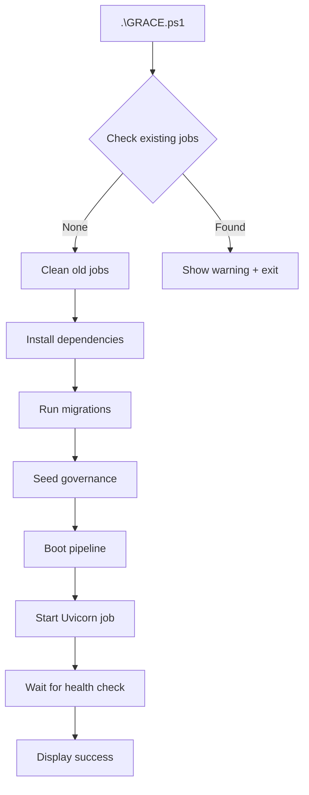

# Grace Process Management

**Problem:** PowerShell wrapper can spawn multiple Uvicorn processes if you run `.\GRACE.ps1` repeatedly.

**Solution:** Always check status before starting a new instance.

---

## Commands

### Start Grace
```powershell
.\GRACE.ps1
```
- Starts Grace in background job
- **Blocks if already running** (prevents duplicates)

### Stop Grace
```powershell
.\GRACE.ps1 -Stop
```
- Stops all Grace background jobs
- Cleans up processes

### Check Status
```powershell
.\GRACE.ps1 -Status
```
- Shows running jobs
- Tests backend health endpoint
- Displays job count and state

### View Logs
```powershell
.\GRACE.ps1 -Logs
```
- Shows last 30 lines from background job

### Stream Logs Live
```powershell
.\GRACE.ps1 -Tail
```
- Live streaming output (Ctrl+C to exit)

---

## Restart Workflow

**Clean restart:**
```powershell
.\GRACE.ps1 -Stop     # Kill existing
.\GRACE.ps1 -Status   # Verify stopped
.\GRACE.ps1           # Start fresh
```

**Quick restart (one-liner):**
```powershell
.\GRACE.ps1 -Stop; .\GRACE.ps1
```

---

## Troubleshooting

### Multiple startup banners
**Cause:** Multiple Uvicorn processes running  
**Fix:** `.\GRACE.ps1 -Stop` before starting new instance

### "Already running" error
**Cause:** Background job exists  
**Options:**
1. `.\GRACE.ps1 -Status` - Check what's running
2. `.\GRACE.ps1 -Stop` - Kill existing instance
3. `.\GRACE.ps1` - Start fresh

### Job count shows 0 but port 8000 busy
**Cause:** Orphaned Uvicorn process  
**Fix:**
```powershell
# Find and kill port 8000
Get-NetTCPConnection -LocalPort 8000 -ErrorAction SilentlyContinue | 
  Select-Object -ExpandProperty OwningProcess | 
  ForEach-Object { Stop-Process -Id $_ -Force }
```

---

## What Changed (2025-11-09)

**Added duplicate prevention:**
- `.\GRACE.ps1` now checks for existing jobs before starting
- Shows helpful error if Grace already running
- Prevents accidental process stacking

**Before:**
```
.\GRACE.ps1  # Starts job 1
.\GRACE.ps1  # Starts job 2 (duplicate!)
.\GRACE.ps1  # Starts job 3 (more duplicates!)
# Result: 3 Uvicorn processes, 3 startup banners
```

**After:**
```
.\GRACE.ps1  # Starts job 1
.\GRACE.ps1  # [WARN] Already running! Use -Stop first
# Result: 1 Uvicorn process, clean state
```

---

## Process Flow



---

## Best Practices

1. **Always check status first**
   ```powershell
   .\GRACE.ps1 -Status
   ```

2. **Clean stop before restart**
   ```powershell
   .\GRACE.ps1 -Stop
   .\GRACE.ps1
   ```

3. **Monitor with tail during development**
   ```powershell
   .\GRACE.ps1 -Tail
   ```

4. **Check health endpoint directly**
   ```powershell
   curl http://localhost:8000/health
   ```

---

**No more duplicate processes.**
