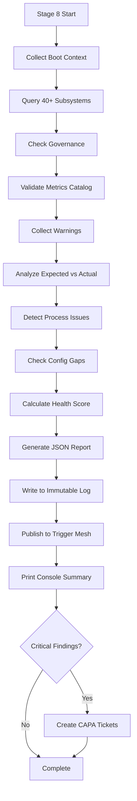

# Boot Forensic Diagnostics

**Feature:** Comprehensive forensic sweep of all subsystems after boot initialization  
**Stage:** 8 (Final boot pipeline stage)  
**Purpose:** Validate every component from kernel load through execution

---

## Overview

The **Boot Diagnostics** system performs a forensic sweep after all services initialize, tracing every subsystem, flagging configuration issues, and generating comprehensive reports.

---

## Architecture

### Three-Phase Process

```
Phase 1: Data Collection
    ↓
Phase 2: Analysis
    ↓
Phase 3: Reporting
```

---

## Phase 1: Data Collection

### Boot Context
- ✅ Run ID, timestamp, git SHA
- ✅ Component versions (Python, FastAPI, SQLAlchemy, etc.)
- ✅ Environment variables loaded
- ✅ Missing secrets (required vs optional)
- ✅ Python path, working directory, platform

### Subsystem Status
Queries **40+ subsystems** for readiness:
- ✅ Core infrastructure (trigger_mesh, reflection, task_executor, health_monitor)
- ✅ Agentic systems (agentic_spine, meta_loop, learning_integration, ethics_sentinel)
- ✅ Self-healing (autonomous_improver, code_healer, log_healer, ml_healing)
- ✅ Metrics & monitoring (metrics_collector, snapshot_aggregator)
- ✅ ML & optimization (performance_optimizer, goal_setting, incident_predictor)
- ✅ Schedulers (playbook_executor, forecast_scheduler)

### Governance Status
- ✅ Governance engine loaded
- ✅ Universal assignment registry count
- ✅ Handshake protocol acknowledgements
- ✅ Crypto component assignments

### Metrics Catalog
- ✅ Total metrics loaded
- ✅ Categories and distribution
- ✅ Missing legacy metric IDs
- ✅ Catalog completeness validation

### Warnings & Skips
- ✅ Autonomous improver whitelist status
- ✅ Files skipped due to TODO/secret markers
- ✅ Metrics collector warnings
- ✅ Governance blocks

---

## Phase 2: Analysis

### Expected vs Actual
- **Critical subsystems** - Must be running (trigger_mesh, health_monitor, metrics_collector)
- **Agentic subsystems** - Should be running (agentic_spine, meta_loop, autonomous_improver)
- **Optional subsystems** - Nice to have

### Process Issues
- ✅ Detects multiple Uvicorn processes (duplicate startups)
- ✅ Counts Python processes
- ✅ Flags hung or orphaned processes

### Configuration Gaps
- ✅ Missing .env file
- ✅ Missing grace.db database
- ✅ Required secrets not set
- ✅ Metrics catalog gaps

### Startup Health Assessment
- ✅ Calculates health score (% of subsystems running)
- ✅ Health status: excellent (95%+), good (85%+), fair (70%+), poor (50%+), critical (<50%)
- ✅ Flags low health scores

---

## Phase 3: Reporting

### Structured JSON Report

```json
{
  "report_type": "boot_diagnostics",
  "version": "1.0",
  "run_id": "boot_20251109_185259",
  "timestamp": "2025-11-09T18:53:00Z",
  "boot_context": {
    "git_sha": "a3f8d2e1",
    "component_versions": {...},
    "env_vars_loaded": {...},
    "missing_required_secrets": [],
    "missing_optional_secrets": ["GITHUB_TOKEN", "AMP_API_KEY"],
    "governance": {...},
    "metrics_catalog": {...},
    "startup_health": {
      "running_subsystems": 38,
      "total_subsystems": 40,
      "health_score": 95.0,
      "health_status": "excellent"
    }
  },
  "subsystems_checked": {...},
  "findings": {
    "critical": [],
    "high": [],
    "medium": [
      {
        "severity": "medium",
        "type": "metrics_catalog_gaps",
        "message": "Metrics catalog missing 1 legacy IDs",
        "context": {"missing": ["autonomy.plan_success_rate"]},
        "remediation": "Add missing metric definitions to config/metrics_catalog.yaml",
        "timestamp": "2025-11-09T18:53:05Z"
      }
    ],
    "low": [],
    "info": []
  },
  "summary": {
    "total_findings": 1,
    "critical_count": 0,
    "high_count": 0,
    "medium_count": 1,
    "low_count": 0,
    "subsystems_running": 38,
    "subsystems_total": 40
  }
}
```

### Console Summary

```
================================================================================
BOOT DIAGNOSTICS REPORT
================================================================================
Run ID: boot_20251109_185259
Timestamp: 2025-11-09T18:53:05.123456Z
Git SHA: a3f8d2e1

Startup Health: ✅ EXCELLENT (95.0%)
  Running: 38/40 subsystems

Findings:
  🔴 Critical: 0
  🟠 High:     0
  🟡 Medium:   1
  🔵 Low:      0

Configuration:
  Required secrets: 0 missing
  Optional secrets: 2 missing
  Metrics catalog: 26 definitions loaded

================================================================================
✅ Boot diagnostics passed - All systems operational
================================================================================
```

### With Critical Issues

```
CRITICAL ISSUES:
  ❌ Critical subsystem trigger_mesh is not running
     Remediation: Check trigger_mesh startup logs and restart if needed
  ❌ Multiple Uvicorn processes detected (3)
     Remediation: Run .\GRACE.ps1 -Stop to clean up, then restart

================================================================================
⚠️  CRITICAL ISSUES DETECTED - Grace may not operate correctly
================================================================================
```

---

## Integration Points

### 1. Immutable Log
Every diagnostics report is written to the immutable audit log:
```python
await immutable_log.append(
    actor="boot_diagnostics",
    action="boot_sweep_complete",
    resource="boot_pipeline",
    subsystem="diagnostics",
    payload=report,
    result="completed"
)
```

### 2. Trigger Mesh
Report published as event for downstream consumers:
```python
await trigger_mesh.publish(TriggerEvent(
    event_type="diagnostics.boot_report",
    source="boot_diagnostics",
    actor="system",
    resource="boot_pipeline",
    payload=report,
    timestamp=datetime.utcnow()
))
```

### 3. CAPA System
**Auto-creates tickets for critical findings:**
```python
for finding in critical_findings:
    await capa_system.create_capa(
        issue_description=finding["message"],
        severity="high",
        category="boot_failure",
        detected_by="boot_diagnostics",
        evidence=finding["context"],
        immediate_action=finding["remediation"]
    )
```

---

## Severity Levels

| Severity | Icon | Description | Action |
|----------|------|-------------|--------|
| **Critical** | 🔴 | System cannot operate correctly | CAPA ticket auto-created, immediate fix required |
| **High** | 🟠 | Major functionality impaired | Review and fix soon |
| **Medium** | 🟡 | Minor issues or gaps | Fix when convenient |
| **Low** | 🔵 | Informational, cosmetic | Optional |
| **Info** | ℹ️ | Status information | No action needed |

---

## Finding Types

### Critical Findings
- `missing_required_secret` - Required environment variable not set
- `critical_subsystem_down` - Essential subsystem not running
- `missing_env_file` - .env file doesn't exist
- `missing_database` - grace.db not found
- `duplicate_uvicorn_processes` - Multiple processes detected
- `low_startup_health` - Health score < 50%

### High Findings
- `agentic_subsystem_down` - Agentic capability limited
- `governance_load_failure` - Governance systems failed
- `metrics_catalog_failure` - Catalog loading failed
- `low_startup_health` - Health score 50-80%

### Medium Findings
- `metrics_catalog_gaps` - Missing metric definitions
- Configuration warnings

---

## Boot Pipeline Integration

### Stage 8 Execution

```python
async def _stage_diagnostics_sweep(self) -> Dict[str, Any]:
    """Forensic sweep after all services initialize"""
    
    from backend.boot_diagnostics import run_boot_diagnostics
    
    # Run full diagnostics
    report = await run_boot_diagnostics(self.run_id)
    
    return {
        "success": report["summary"]["critical_count"] == 0,
        "report": report,
        "critical_count": report["summary"]["critical_count"],
        "health_score": report["boot_context"]["startup_health"]["health_score"]
    }
```

### When It Runs

```
Stage 1: Environment & Dependencies
Stage 2: Schema & Secrets Guardrail
Stage 3: Safe-Mode Boot & Self-Heal
Stage 4: Playbook & Metrics Verification
Stage 5: Full Service Bring-up (meta_loop, agentic_spine start here)
Stage 6: Smoke Tests & Health Checks
Stage 7: Continuous Oversight Setup
Stage 8: Forensic Diagnostics Sweep ← NEW
```

**After Stage 8:**
- All subsystems initialized
- Diagnostics validated everything
- Report generated and distributed
- CAPA tickets created if needed

---

## Example Diagnostics Flow



---

## Remediation Examples

### Critical: Missing Required Secret
```bash
# Finding
❌ Required secret DATABASE_URL is not set

# Remediation
echo "DATABASE_URL=sqlite:///./backend/grace.db" >> .env
```

### High: Multiple Uvicorn Processes
```powershell
# Finding
⚠️  Multiple Uvicorn processes detected (3)

# Remediation
.\GRACE.ps1 -Stop
.\GRACE.ps1 -Status  # Verify stopped
.\GRACE.ps1          # Start fresh
```

### Medium: Metrics Catalog Gap
```yaml
# Finding
🟡 Metrics catalog missing 1 legacy IDs: autonomy.plan_success_rate

# Remediation
# Add to config/metrics_catalog.yaml:
- metric_id: autonomy.plan_success_rate
  category: autonomy
  description: "Success rate of autonomous plan execution"
  unit: ratio
  aggregation: avg
```

---

## Benefits

### For Developers
- 🔍 Complete visibility into boot health
- 🎯 Precise error location and remediation
- 📊 Health score trending over time
- 🔗 Automatic CAPA ticket creation

### For Grace
- 🤖 Self-awareness of missing capabilities
- 📈 Boot health metrics for learning
- 🛡️ Early detection of configuration drift
- 🔄 Feedback loop for self-healing

### For Operations
- ✅ One-glance health assessment
- 📋 Audit trail of every boot
- 🚨 Automatic alerting on critical issues
- 📖 Comprehensive diagnostics reports

---

## Next Steps

1. **Boot Grace** - Diagnostics run automatically as Stage 8
2. **Review Report** - Check console summary for issues
3. **Fix Critical** - Address any 🔴 critical findings immediately
4. **Monitor Trends** - Track health score over time
5. **Tune Thresholds** - Adjust severity levels as needed

---

**Grace now has full forensic visibility into her own boot process.**
