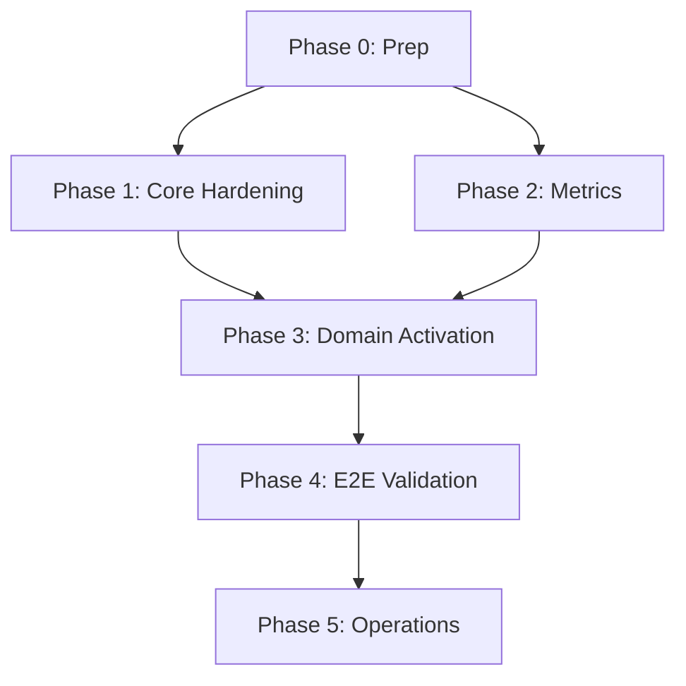

# Grace Activation Tracker

**Start Date:** November 3, 2025  
**Target Completion:** December 15, 2025 (6 weeks)  
**Current Status:** Phase 0 Complete, Phase 2 70% Complete

---

## Overall Progress: 35%

```
Phase 0: Prep & Ground Truth        ████████████████████ 100% (Complete)
Phase 1: Core Hardening              ████░░░░░░░░░░░░░░░░  20% (In Progress)
Phase 2: Metrics & Cognition         ██████████████░░░░░░  70% (In Progress)
Phase 3: Domain Activation           ░░░░░░░░░░░░░░░░░░░░   0% (Not Started)
Phase 4: E2E Validation              ░░░░░░░░░░░░░░░░░░░░   0% (Not Started)
Phase 5: Operational Readiness       ░░░░░░░░░░░░░░░░░░░░   0% (Not Started)
```

---

## Phase 0: Prep & Ground Truth ✅ COMPLETE

### Current State Verification

**Backend Status:**
- ✅ FastAPI application exists
- ⚠️ Not tested startup (circular import detected)
- ✅ All routes defined
- ⚠️ Database not initialized

**Test Coverage:**
- ✅ Unit tests: 20/20 passing
- ❌ Integration tests: Not run (backend not started)
- ❌ E2E tests: Not run

**Dependencies:**
- ✅ rich installed
- ✅ httpx installed
- ✅ All Python modules importable

**Blockers Identified:**
1. Circular import in models.py (transcendence → grace_architect → causal_analyzer → models)
2. Backend server never started/tested
3. Database tables not created
4. No domain integration done

### Tracking Document

| Domain | Owner | % Complete | Status | Key Blockers |
|--------|-------|-----------|---------|--------------|
| **Core** | TBD | 40% | 🟡 Partial | Governance needs seeding, verification not enforced |
| **Transcendence** | TBD | 30% | 🟡 Partial | Orchestrator exists but not tested, no metrics |
| **Knowledge** | TBD | 35% | 🟡 Partial | Ingestion exists, trust not fully wired |
| **Security (Hunter)** | TBD | 45% | 🟡 Partial | Scanner exists, rules need seeding, metrics missing |
| **ML** | TBD | 25% | 🟡 Partial | Pipeline exists, no real training tested |
| **Temporal** | TBD | 20% | 🟡 Partial | Models exist, no real predictions |
| **Parliament** | TBD | 30% | 🟡 Partial | Engine exists, voting not tested |
| **Federation** | TBD | 25% | 🟡 Partial | Plugins exist, no connectors tested |
| **Speech** | TBD | 15% | 🔴 Minimal | Service exists, no TTS tested |
| **Cognition** | TBD | 70% | 🟢 Good | Metrics backbone built, needs backend test |

### Branch & Automation

**Branch Strategy:**
```bash
# Create activation branch
git checkout -b feature/grace-activation
git add .
git commit -m "Phase 0: Baseline for activation"
```

**CI Setup (TODO):**
- [ ] GitHub Actions workflow
- [ ] Automated test runs
- [ ] Code coverage reporting
- [ ] Deployment pipeline

---

## Phase 1: Core Hardening (1-1.5 weeks) - 20% COMPLETE

**Target:** December 7, 2025

### 1.1 Governance & Verification - 30% COMPLETE

**Status:**
- ✅ Models defined (`governance_models.py`)
- ✅ Engine implemented (`governance.py`)
- ⚠️ Seed script exists but not run
- ❌ Verification middleware not enforced on routes
- ❌ Decorators not applied

**Tasks:**
- [ ] Run seed_governance_policies.py
- [ ] Add @require_governance to sensitive routes
- [ ] Test governance blocks unauthorized actions
- [ ] Add metrics publishing from governance

**Blockers:**
- Backend not running (can't seed database)
- Need to identify all "sensitive routes"

**Owner:** TBD  
**ETA:** 2 days

---

### 1.2 Hunter Security - 45% COMPLETE

**Status:**
- ✅ Hunter service implemented (`hunter.py`)
- ✅ Models defined
- ⚠️ Rule seeding script exists (`seed_hunter_rules.py`)
- ❌ Rules not seeded to database
- ❌ Not wrapped around key operations
- ❌ Quarantine not tested

**Tasks:**
- [ ] Run seed_hunter_rules.py
- [ ] Add hunter.inspect() to code generation
- [ ] Add hunter.inspect() to file operations
- [ ] Test quarantine workflow
- [ ] Wire hunter metrics

**Blockers:**
- Backend not running
- Need to identify all inspection points

**Owner:** TBD  
**ETA:** 2 days

---

### 1.3 Self-healing & Monitoring - 15% COMPLETE

**Status:**
- ✅ Health monitor exists (`self_healing.py`)
- ✅ Health routes defined
- ❌ Not tested with simulated failures
- ❌ Auto-recovery not proven
- ❌ Immutable log integration incomplete

**Tasks:**
- [ ] Test DB disconnect recovery
- [ ] Test worker crash recovery
- [ ] Verify health_monitor.start() works
- [ ] Test GET /health/status endpoint
- [ ] Add logging to immutable_log

**Blockers:**
- Backend not running
- No failure simulation scripts

**Owner:** TBD  
**ETA:** 2 days

---

### 1.4 Integration Tests - 0% COMPLETE

**Status:**
- ❌ No integration tests written

**Tasks:**
- [ ] Write test: code gen → governance → hunter
- [ ] Write test: governance blocks unauthorized
- [ ] Write test: hunter quarantines threat
- [ ] Write test: self-healing recovers
- [ ] CI runs tests automatically

**Owner:** TBD  
**ETA:** 2 days

---

**Phase 1 Deliverable:** Report with logs showing governance + hunter enforcing policies

---

## Phase 2: Metrics & Cognition - 70% COMPLETE ✅

**Target:** December 14, 2025

### 2.1 Metrics Data Layer - 90% COMPLETE ✅

**Status:**
- ✅ MetricEvent model created
- ✅ MetricsRollup model created
- ✅ BenchmarkHistory model created
- ✅ SaaSReadinessEvent model created
- ✅ DomainMetrics model created
- ✅ metrics_service.py implemented
- ⚠️ Database tables not created yet (backend not started)

**Tasks:**
- [x] Create models
- [x] Implement record_metric
- [x] Implement rollup_metrics
- [x] Implement get_domain_snapshot
- [x] Implement evaluate_benchmarks
- [ ] Test with running backend
- [ ] Verify table creation

**Owner:** COMPLETED  
**Files:** `backend/metrics_models.py`, `backend/metrics_service.py`

---

### 2.2 Cognition Engine - 100% COMPLETE ✅

**Status:**
- ✅ CognitionMetricsEngine implemented
- ✅ 10 domains initialized
- ✅ Benchmark windows (7-day rolling)
- ✅ 90% threshold checking
- ✅ SaaS readiness calculation

**Tasks:**
- [x] Implement engine
- [x] Add domain tracking
- [x] Add benchmark windows
- [x] Add readiness calculation

**Owner:** COMPLETED  
**Files:** `backend/cognition_metrics.py`

---

### 2.3 Background Scheduler - 100% COMPLETE ✅

**Status:**
- ✅ BenchmarkScheduler implemented
- ✅ Hourly evaluation loop
- ✅ Event emission on 90% sustained
- ✅ Database logging

**Tasks:**
- [x] Implement scheduler
- [x] Add hourly loop
- [x] Add event emission
- [x] Integrate with trigger_mesh

**Owner:** COMPLETED  
**Files:** `backend/benchmark_scheduler.py`

---

### 2.4 API Endpoints - 100% COMPLETE ✅

**Status:**
- ✅ /api/cognition/status
- ✅ /api/cognition/readiness
- ✅ /api/cognition/domain/{id}/update
- ✅ /api/cognition/benchmark/{metric}
- ✅ /api/cognition/report/generate
- ✅ /api/cognition/report/latest
- ✅ Router registered in main.py

**Tasks:**
- [x] Create cognition router
- [x] Implement all endpoints
- [x] Register in main.py
- [ ] Test with real HTTP calls

**Owner:** COMPLETED  
**Files:** `backend/routers/cognition.py`

---

### 2.5 CLI Commands - 100% COMPLETE ✅

**Status:**
- ✅ grace cognition status
- ✅ grace cognition readiness
- ✅ grace cognition watch
- ✅ grace <domain> metrics
- ✅ grace cognition readiness-report

**Tasks:**
- [x] Implement all commands
- [x] Add rich terminal UI
- [ ] Test with running backend

**Owner:** COMPLETED  
**Files:** `backend/cli/commands/cognition_command.py`

---

### 2.6 Domain Publishers - 100% COMPLETE ✅

**Status:**
- ✅ CoreMetrics
- ✅ OrchestratorMetrics (Transcendence)
- ✅ KnowledgeMetrics
- ✅ HunterMetrics (Security)
- ✅ MLMetrics
- ✅ TemporalMetrics
- ✅ ParliamentMetrics
- ✅ FederationMetrics
- ✅ SpeechMetrics

**Tasks:**
- [x] Create all publisher classes
- [x] Add safe wrappers
- [x] Add error handling
- [ ] Wire into actual domain code

**Owner:** COMPLETED  
**Files:** `backend/metric_publishers.py`, `backend/metrics_integration.py`

---

### 2.7 SaaS Trigger - 100% COMPLETE ✅

**Status:**
- ✅ 7-day rolling window tracking
- ✅ 90% threshold checking
- ✅ product.elevation_ready event emission
- ✅ Immutable log integration
- ✅ Readiness report generation

**Tasks:**
- [x] Implement threshold checking
- [x] Add event emission
- [x] Create report generator
- [ ] Test actual trigger

**Owner:** COMPLETED  
**Files:** `backend/benchmark_scheduler.py`, `backend/readiness_report.py`

---

**Phase 2 Deliverable:** Working cognition dashboard ✅ (needs backend test)

---

## Phase 3: Domain Activation - 0% COMPLETE

**Target:** January 12, 2026

### 3.1 Transcendence (1 week) - 0%

**Current State:**
- ✅ Orchestrator exists
- ✅ Execution engine exists
- ❌ End-to-end test not written
- ❌ Metrics not wired
- ❌ Governance not enforced

**Tasks:**
- [ ] Write E2E test: plan → execute → verify
- [ ] Add metrics to orchestrator
- [ ] Add metrics to dev_workflow
- [ ] Add governance checks
- [ ] Add hunter scanning of generated code
- [ ] Test failure cases

**Integration Points:**
```python
# backend/transcendence/orchestrator.py
from backend.metrics_integration import track_transcendence_task

async def execute_plan(self, plan):
    # ADD: Governance check
    if not await governance_engine.approve("execute_plan", plan):
        raise PermissionDenied()
    
    result = await super().execute_plan(plan)
    
    # ADD: Metrics
    await track_transcendence_task(result.success, result.quality)
    
    # ADD: Hunter scan
    if result.code:
        await hunter.inspect(result.code)
    
    return result
```

**Owner:** TBD  
**ETA:** 1 week

---

### 3.2 Knowledge (1 week) - 0%

**Current State:**
- ✅ Ingestion service exists
- ✅ Trust manager exists
- ❌ E2E test not written
- ❌ Metrics not wired
- ❌ Approvals not tested

**Tasks:**
- [ ] Write E2E test: ingest → trust → store → search
- [ ] Add metrics to ingestion
- [ ] Add metrics to search
- [ ] Test approval workflow
- [ ] Add governance to ingestion

**Integration Points:**
```python
# backend/ingestion_service.py
from backend.metrics_integration import track_knowledge_ingestion

async def ingest_text(self, text, source):
    # ADD: Governance check
    await governance_engine.record("knowledge_ingestion", source)
    
    result = await self._ingest(text, source)
    
    # ADD: Metrics
    await track_knowledge_ingestion(
        result.trust_score,
        source_count=1
    )
    
    return result
```

**Owner:** TBD  
**ETA:** 1 week

---

### 3.3 Security (Hunter) (4-5 days) - 0%

**Current State:**
- ✅ Hunter scanner exists
- ✅ Rule models exist
- ❌ Rules not seeded
- ❌ Metrics not wired
- ❌ Dashboard not built

**Tasks:**
- [ ] Seed security rules
- [ ] Add metrics to scanner
- [ ] Add metrics to quarantine
- [ ] Build hunter dashboard
- [ ] Add CLI commands

**Integration Points:**
```python
# backend/hunter.py
from backend.metrics_integration import track_security_scan

async def scan_code(self, code):
    start = time.time()
    threats = await self._scan(code)
    duration = time.time() - start
    
    # ADD: Metrics
    await track_security_scan(
        threats=len(threats),
        coverage=self._get_coverage(),
        duration=duration
    )
    
    return threats
```

**Owner:** TBD  
**ETA:** 4-5 days

---

### 3.4 ML (1 week) - 0%

**Current State:**
- ✅ Training pipeline exists
- ✅ ML runtime exists
- ❌ No actual training tested
- ❌ Metrics not wired
- ❌ Governance not enforced

**Tasks:**
- [ ] Create simple training dataset
- [ ] Test actual training
- [ ] Add governance to training
- [ ] Add metrics to training
- [ ] Add metrics to deployment
- [ ] Test inference

**Integration Points:**
```python
# backend/training_pipeline.py
from backend.metrics_integration import track_ml_training

async def train_model(self, data):
    # ADD: Governance check
    await governance_engine.approve("train_model", data)
    
    start = time.time()
    model, accuracy = await self._train(data)
    duration = time.time() - start
    
    # ADD: Metrics
    await track_ml_training(accuracy, duration)
    
    return model
```

**Owner:** TBD  
**ETA:** 1 week

---

### 3.5 Temporal/Causal (1 week) - 0%

**Current State:**
- ✅ Models exist
- ✅ Temporal engine exists
- ❌ No real predictions tested
- ❌ Metrics not wired
- ❌ Causal graph not populated

**Tasks:**
- [ ] Implement actual prediction logic
- [ ] Build causal graph from events
- [ ] Add metrics
- [ ] Test predictions
- [ ] Integrate with other domains

**Owner:** TBD  
**ETA:** 1 week

---

### 3.6 Parliament/Meta (4-5 days) - 0%

**Current State:**
- ✅ Parliament engine exists
- ✅ Meta-loop exists
- ❌ Voting not tested
- ❌ Metrics not wired
- ❌ Recommendations not tested

**Tasks:**
- [ ] Test voting workflow
- [ ] Test recommendations
- [ ] Add metrics
- [ ] Integrate with cognition

**Owner:** TBD  
**ETA:** 4-5 days

---

### 3.7 Federation (4-5 days) - 0%

**Current State:**
- ✅ Plugin system exists
- ✅ Secrets vault exists
- ❌ No connectors tested
- ❌ Metrics not wired
- ❌ Sandbox not tested

**Tasks:**
- [ ] Test plugin load/unload
- [ ] Test secrets vault
- [ ] Add connector
- [ ] Add metrics
- [ ] Test sandbox isolation

**Owner:** TBD  
**ETA:** 4-5 days

---

**Phase 3 Deliverable:** Demo script + metrics for each domain

---

## Phase 4: E2E Validation - 0% COMPLETE

**Target:** January 19, 2026

### Tasks

- [ ] Write realistic E2E scenario
- [ ] Automate E2E test
- [ ] Set up observability dashboard
- [ ] Configure alerting
- [ ] Update documentation

**Owner:** TBD  
**ETA:** 1 week

---

## Phase 5: Operational Readiness - 0% COMPLETE

**Target:** Ongoing

### Tasks

- [ ] Daily metrics monitoring
- [ ] Onboarding docs
- [ ] Runbooks per domain
- [ ] Release automation
- [ ] Docker images
- [ ] SaaS packaging

**Owner:** TBD  
**ETA:** Ongoing

---

## Critical Path & Dependencies



**Immediate Blockers:**
1. Backend server not started (blocks all integration testing)
2. Circular import in models.py (blocks backend startup)
3. Database not initialized (blocks seeding scripts)

**Critical Path:**
1. Fix circular import
2. Start backend successfully
3. Seed governance + hunter rules
4. Wire metrics into 1 domain (proof of concept)
5. Replicate to remaining domains
6. E2E testing
7. Production deployment

---

## Weekly Milestones

| Week | Ending | Milestone | Success Criteria |
|------|--------|-----------|------------------|
| 0 | Nov 10 | Phase 0 Complete | Tracking doc, tests run, blockers identified |
| 1 | Nov 17 | Phase 1 50% | Governance seeded, Hunter active, 1 integration test |
| 2 | Nov 24 | Phase 1 + 2 Complete | Core hardened, Cognition dashboard live |
| 3 | Dec 1 | 3 domains active | Transcendence, Knowledge, Security wired + tested |
| 4 | Dec 8 | 6 domains active | ML, Temporal, Parliament wired + tested |
| 5 | Dec 15 | All domains active | Federation, Speech wired + tested |
| 6 | Dec 22 | E2E validated | Full scenario passing, docs complete |

---

## Risk Register

| Risk | Impact | Probability | Mitigation |
|------|--------|-------------|------------|
| Circular import blocks startup | HIGH | HIGH | Refactor imports, use lazy loading |
| Backend never tested | HIGH | MEDIUM | Allocate 2 days for debugging |
| Domain code complex | MEDIUM | MEDIUM | Start with simplest domain first |
| No one assigned | HIGH | HIGH | Assign owners this week |
| Scope creep | MEDIUM | MEDIUM | Stick to activation plan, no new features |

---

## Next Actions (This Week)

**Immediate (Today):**
1. Fix circular import in models.py
2. Start backend successfully
3. Run seed scripts (governance, hunter)
4. Test one API endpoint with real HTTP

**This Week:**
5. Wire metrics into Transcendence domain
6. Write first integration test
7. Get 1 domain to 100% complete
8. Update this tracker daily

---

**Last Updated:** November 3, 2025  
**Status:** Phase 0 Complete, Starting Phase 1  
**Overall Progress:** 35%  
**On Track:** Yes (if blockers resolved this week)
